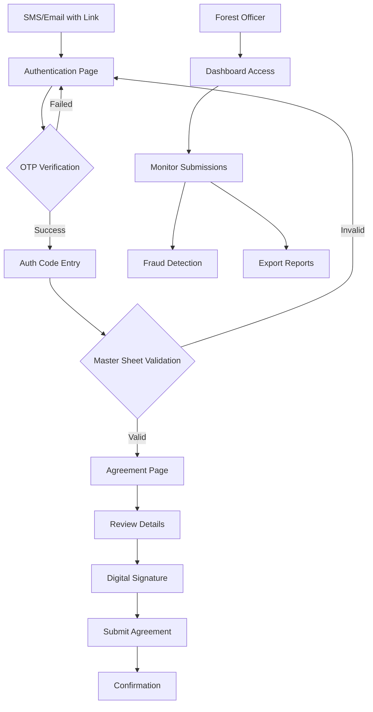

## 1. Product Overview
A secure, mobile-friendly digital signature system for 1,800 AITE-2026 volunteers in Telangana Forest Department. The system provides OTP-verified authentication, anti-cheating measures, and real-time tracking dashboard for government field deployment.

**Target Users:** Forest Department volunteers participating in AITE-2026 program
**Core Purpose:** Streamline volunteer agreement collection with secure digital signatures and comprehensive audit tracking

## 2. Core Features

### 2.1 User Roles
| Role | Registration Method | Core Permissions |
|------|---------------------|------------------|
| Volunteer | OTP + Auth Code verification | Access agreement page, sign digitally |
| Forest Officer | Admin dashboard access | Monitor submissions, view fraud flags, download reports |

### 2.2 Feature Module
The system consists of the following essential pages:
1. **Authentication Page**: Mobile number input, OTP verification, auth code validation
2. **Agreement Page**: Auto-filled volunteer details, declaration text, digital signature pad
3. **Dashboard Page**: Live tracking with fraud detection, submission monitoring

### 2.3 Page Details
| Page Name | Module Name | Feature description |
|-----------|-------------|---------------------|
| Authentication Page | Mobile Input | Accept 10-digit mobile number with validation |
| Authentication Page | OTP Verification | Send and verify 6-digit OTP code |
| Authentication Page | Auth Code Input | Validate format (Last4Digits-DistrictCode) against master sheet |
| Authentication Page | Security Tracking | Record device fingerprint, IP address, attempt logging |
| Agreement Page | Auto-fill Section | Display volunteer name and district from master sheet |
| Agreement Page | Declaration Text | Show government agreement with reference number WL17/2025/WL-3 |
| Agreement Page | Terms Checkbox | Require explicit consent to all 4 declaration conditions |
| Agreement Page | Signature Pad | Enable finger-based digital signature with image capture |
| Agreement Page | Auto-timestamp | Record submission time automatically |
| Dashboard Page | Live Tracking Table | Display all volunteer submissions with fraud flag indicators |
| Dashboard Page | Filter Controls | Filter by Completed, Pending, Unopened, Fraud Suspects |
| Dashboard Page | Export Function | Download signed agreements as PDF with audit trail |

## 3. Core Process

### Volunteer Flow
1. Volunteer receives SMS/Email with unique signing link and auth code
2. Accesses authentication page via mobile device
3. Enters mobile number and receives OTP
4. Completes OTP verification
5. Enters auth code (Last4Digits-DistrictCode format)
6. System validates against master sheet and unlocks agreement
7. Reviews auto-filled personal details and agreement text
8. Checks consent checkbox for all declaration terms
9. Provides digital signature using finger on mobile screen
10. System records submission with timestamp, IP, device info
11. Receives confirmation of successful agreement submission

### Officer Flow
1. Accesses dashboard with administrative privileges
2. Monitors real-time submission status across all districts
3. Identifies fraud-flagged entries requiring investigation
4. Contacts pending volunteers via provided contact information
5. Downloads signed agreements as PDF documents
6. Reviews audit trails for compliance verification

## 4. User Interface Design

### 4.1 Design Style
- **Primary Colors:** Forest green (#228B22), Government blue (#1E3A8A)
- **Secondary Colors:** White background, light gray (#F5F5F5) for sections
- **Button Style:** Rounded corners, prominent green for primary actions
- **Font:** System fonts optimized for mobile readability (16px base)
- **Layout:** Card-based design with clear visual hierarchy
- **Icons:** Government-style minimal icons, no emojis

### 4.2 Page Design Overview
| Page Name | Module Name | UI Elements |
|-----------|-------------|-------------|
| Authentication Page | Mobile Input | Large numeric keypad, clear input field with country code prefix |
| Authentication Page | OTP Input | 6-digit input boxes with auto-focus progression |
| Authentication Page | Auth Code | Text input with format hint (e.g., "1234-ATR") |
| Agreement Page | Header | Government of Telangana logo and official header styling |
| Agreement Page | Declaration | Scrollable text area with official document formatting |
| Agreement Page | Signature | Full-width signature pad with clear instructions |
| Dashboard Page | Data Table | Responsive table with status indicators and color coding |

### 4.3 Responsiveness
- **Mobile-first design** optimized for smartphone usage in field conditions
- **Touch-optimized** signature pad with finger-friendly interface
- **Responsive scaling** for tablets and desktop viewing
- **Offline capability** consideration for poor network areas

## 5. Security & Compliance Features
- OTP-based identity verification preventing impersonation
- Device fingerprinting and IP tracking for audit trails
- One-response enforcement per volunteer preventing duplicate submissions
- Real-time fraud detection with automatic flagging
- Encrypted storage of digital signatures and personal data
- Comprehensive audit logs for government compliance
- PDF output with complete audit trail for legal validity