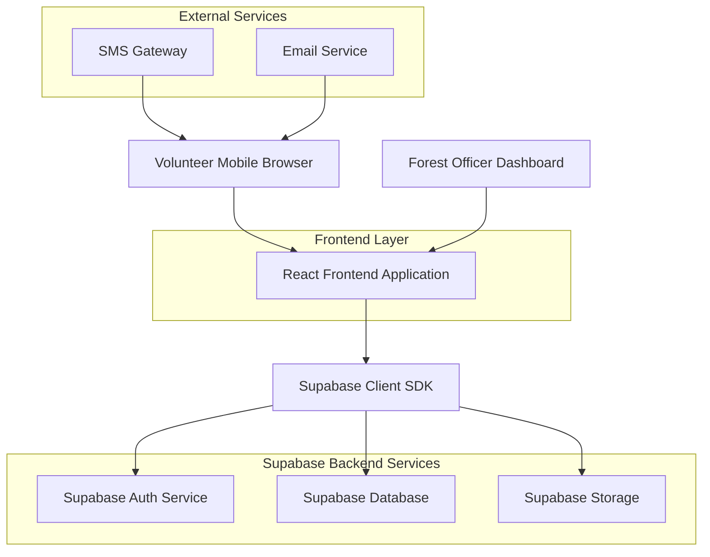
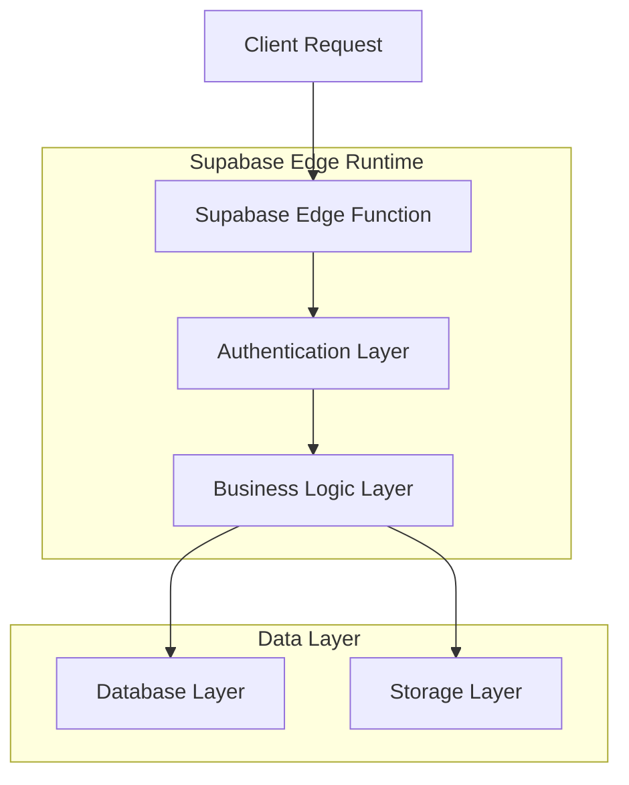
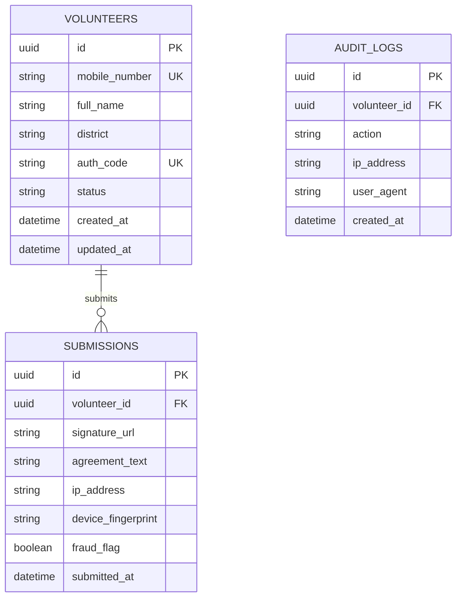

## 1. Architecture Design



## 2. Technology Description

- **Frontend:** React@18 + Tailwind CSS@3 + Vite
- **Initialization Tool:** vite-init
- **Backend:** Supabase (PostgreSQL, Authentication, Storage, Edge Functions)
- **Signature Library:** react-signature-canvas
- **Mobile Optimization:** react-device-detect
- **PDF Generation:** jspdf + html2canvas

## 3. Route Definitions

| Route | Purpose |
|-------|---------|
| / | Authentication page with mobile and OTP verification |
| /agreement | Agreement form with auto-filled details and signature pad |
| /dashboard | Admin dashboard for monitoring submissions |
| /api/verify-auth | Backend endpoint for auth code validation |
| /api/generate-pdf | PDF generation endpoint for signed agreements |

## 4. API Definitions

### 4.1 Authentication APIs

**Verify Auth Code**
```
POST /api/verify-auth
```

Request:
| Param Name | Param Type | isRequired | Description |
|------------|-------------|-------------|-------------|
| mobile | string | true | 10-digit mobile number |
| authCode | string | true | Auth code format (XXXX-YYY) |
| otpToken | string | true | Supabase OTP verification token |

Response:
| Param Name | Param Type | Description |
|------------|-------------|-------------|
| valid | boolean | Auth code validation status |
| volunteerData | object | Volunteer details if valid |
| error | string | Error message if invalid |

### 4.2 Submission APIs

**Save Agreement**
```
POST /api/submit-agreement
```

Request:
| Param Name | Param Type | isRequired | Description |
|------------|-------------|-------------|-------------|
| volunteerId | string | true | Volunteer UUID |
| signatureData | string | true | Base64 signature image |
| agreementText | string | true | Full agreement content |
| deviceFingerprint | string | true | Browser/device identifier |

## 5. Server Architecture Diagram



## 6. Data Model

### 6.1 Data Model Definition



### 6.2 Data Definition Language

**Volunteers Table**
```sql
-- create table
CREATE TABLE volunteers (
    id UUID PRIMARY KEY DEFAULT gen_random_uuid(),
    mobile_number VARCHAR(10) UNIQUE NOT NULL,
    full_name VARCHAR(100) NOT NULL,
    district VARCHAR(50) NOT NULL,
    auth_code VARCHAR(20) UNIQUE NOT NULL,
    status VARCHAR(20) DEFAULT 'pending' CHECK (status IN ('pending', 'completed', 'fraud_suspect')),
    created_at TIMESTAMP WITH TIME ZONE DEFAULT NOW(),
    updated_at TIMESTAMP WITH TIME ZONE DEFAULT NOW()
);

-- create indexes
CREATE INDEX idx_volunteers_mobile ON volunteers(mobile_number);
CREATE INDEX idx_volunteers_auth_code ON volunteers(auth_code);
CREATE INDEX idx_volunteers_status ON volunteers(status);
CREATE INDEX idx_volunteers_district ON volunteers(district);
```

**Submissions Table**
```sql
-- create table
CREATE TABLE submissions (
    id UUID PRIMARY KEY DEFAULT gen_random_uuid(),
    volunteer_id UUID REFERENCES volunteers(id) ON DELETE CASCADE,
    signature_url TEXT NOT NULL,
    agreement_text TEXT NOT NULL,
    ip_address INET NOT NULL,
    device_fingerprint VARCHAR(255) NOT NULL,
    fraud_flag BOOLEAN DEFAULT FALSE,
    submitted_at TIMESTAMP WITH TIME ZONE DEFAULT NOW()
);

-- create indexes
CREATE INDEX idx_submissions_volunteer_id ON submissions(volunteer_id);
CREATE INDEX idx_submissions_fraud_flag ON submissions(fraud_flag);
CREATE INDEX idx_submissions_submitted_at ON submissions(submitted_at DESC);
```

**Audit Logs Table**
```sql
-- create table
CREATE TABLE audit_logs (
    id UUID PRIMARY KEY DEFAULT gen_random_uuid(),
    volunteer_id UUID REFERENCES volunteers(id) ON DELETE CASCADE,
    action VARCHAR(50) NOT NULL,
    ip_address INET NOT NULL,
    user_agent TEXT,
    created_at TIMESTAMP WITH TIME ZONE DEFAULT NOW()
);

-- create indexes
CREATE INDEX idx_audit_volunteer_id ON audit_logs(volunteer_id);
CREATE INDEX idx_audit_created_at ON audit_logs(created_at DESC);
```

### 6.3 Row Level Security (RLS) Policies

```sql
-- Enable RLS
ALTER TABLE volunteers ENABLE ROW LEVEL SECURITY;
ALTER TABLE submissions ENABLE ROW LEVEL SECURITY;
ALTER TABLE audit_logs ENABLE ROW LEVEL SECURITY;

-- Grant basic read access to anon role
GRANT SELECT ON volunteers TO anon;
GRANT SELECT ON submissions TO anon;

-- Grant full access to authenticated role
GRANT ALL PRIVILEGES ON volunteers TO authenticated;
GRANT ALL PRIVILEGES ON submissions TO authenticated;
GRANT ALL PRIVILEGES ON audit_logs TO authenticated;

-- RLS Policies for volunteers table
CREATE POLICY "Allow anon read volunteers" ON volunteers FOR SELECT TO anon USING (true);
CREATE POLICY "Allow authenticated full access" ON volunteers FOR ALL TO authenticated USING (true);

-- RLS Policies for submissions table
CREATE POLICY "Allow anon read submissions" ON submissions FOR SELECT TO anon USING (true);
CREATE POLICY "Allow authenticated manage submissions" ON submissions FOR ALL TO authenticated USING (true);
```

### 6.4 Initial Data Insertion

```sql
-- Sample district codes and volunteer data
INSERT INTO volunteers (mobile_number, full_name, district, auth_code) VALUES
('8686196814', 'Sample Volunteer 1', 'Amrabad Tiger Reserve', '6814-ATR'),
('9123456789', 'Sample Volunteer 2', 'Kawal Tiger Reserve', '6789-KTR'),
('9876543210', 'Sample Volunteer 3', 'Hyderabad', '3210-HYD');
```

## 7. Security Implementation

### 7.1 Authentication Flow
- Supabase Phone Auth for OTP verification
- Custom auth code validation against master sheet
- Device fingerprinting using browser characteristics
- IP address logging for audit trails
- Rate limiting on authentication attempts

### 7.2 Anti-Cheating Measures
- One submission per volunteer enforcement
- Duplicate attempt blocking with clear error messages
- Real-time fraud detection algorithm
- Comprehensive audit logging
- Encrypted signature storage in Supabase Storage

### 7.3 Data Protection
- All personal data encrypted at rest
- Secure transmission via HTTPS
- Minimal data collection principle
- GDPR-compliant data handling
- Regular security audit capabilities